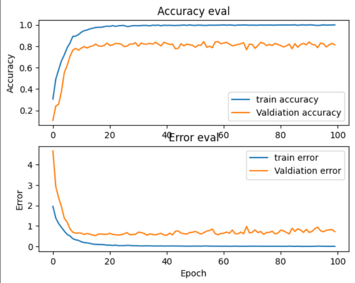

# Music Genre Classification Project

## Introduction
This project aims to classify music genres using various machine learning models. The project includes a comprehensive analysis and feature extraction from audio data, model training, evaluation, and deployment using AWS services and GitHub Actions for CI/CD.

This repo contains docker images to make 3 distinct containers namely nginx, uwsgi-flask app and bento-model. These 3 containers are built up and connected via docker-compose. 

- nginx is used for reverse proxy. 
- uwsgi and flask are used for wsgi protocol server and REST API respectively.
- bento-model contains packaged bento which is the keras model packaged and serviced with [BentoML](https://docs.bentoml.com/en/latest/).

## Colab Notebook
The `Notebook` folder contains a Google Colab notebook that illustrates the entire process of the project, from data analysis to model training, model evaluation and model saving for local use later. 

## About the data
The [GTZAN dataset](https://www.kaggle.com/datasets/andradaolteanu/gtzan-dataset-music-genre-classification) has been used to train these models. Although with features extraction, a custom dataset has been made for model training. Initial model is trained on 2000 samples for 10 genres. So, 200 samples per genre.<br>Here is the link for the [GTZAN dataset](https://drive.google.com/drive/folders/1yRfvQUQNhuSfFcPqCUxYn4KHtSTqtu4z?usp=drive_link) as the kaggle dataset had one corrupted file jazz.00054.wav at the time of testing. 

### Features of the Notebook
- **Audio Data Analysis:** The notebook begins with an analysis of the audio data, explaining the characteristics and peculiarities of audio data in the context of machine learning.
- **Feature Extraction:** Details the process of extracting meaningful features from raw audio data which are crucial for training the models.
- **Model Training and Evaluation:** Discusses the training of different models, their performance metrics, and the rationale behind choosing the best-performing model.
- **Model Selection and Saving:** Explains the criteria for selecting the final model and the process of saving it for deployment.

### Model Performance Graphs
Out of all the models that were tested(sequential model, CNN, LSTM , different combinations of models for over-fitting) this project utilises the CNN model for it's genre predictions.
Below are the performance graphs for the selected model. These graphs represent model accuracy and error vs training epochs.



## Manual AWS EC2 Installation
For manual deployment on AWS EC2 instance, follow the steps below:
Manual setup of the project uses the docker-compose.yml and init.sh files for all the installations and setting up the network.
### 1. **Set up EC2 Instance:**
   - Follow the article to setup an EC2 linux x86_64 instance: [Setting up AWS EC2 instance](https://docs.aws.amazon.com/AWSEC2/latest/UserGuide/EC2_GetStarted.html).
   - This project is tested and developed on a t2.medium instance type and runs on ubuntu:latest.

### 2. **Environment Setup:**
   - Connect to your EC2 instance using SSH.
   ```bash
   ssh -i /path/to/your-key.pem ec2-user@your-instance-public-dns
   ```

### 3. **Deployment:** 
    Clone the project repo in the EC2 instance from GitHub.
    ```bash
    git clone https://github.com/Sun-of-a-beach/Music_Genre_Classification.git
    cd Music_Genre_Classification
    ./init.sh ## Run the init.sh ,that will install everything and run the containers at port 80.
    ```

## Automated Deployment using GitHub Actions
Automated CI/CD pipeline(.github/workflows/deploy.yml) uses docker-compose-production.yml(updated image URI from ECR) and deploy.sh to install and run the containers. 

This project uses GitHub Actions for Continuous Integration and Continuous Deployment (CI/CD). The workflow involves:

1. **Pushing to the Repository:** Any push to the main branch triggers the CI/CD pipeline.
2. **Building Docker Images:** The workflow builds Docker images for the application and pushes them to AWS ECR. It creates 3 separate ECR repos and images. The repos and images should have the same name_space.
3. **Deployment to AWS EC2:** After pushing the images to ECR, the workflow pulls the images from ECR in EC2 and deploys them on AWS EC2 using `docker-compose`.

For more details, refer to the `.github/workflows/deploy.yml` file in the repository.

To get the workflow running, aws credentials must be configured inside the EC2 terminal.
For which install the [aws client](https://docs.aws.amazon.com/cli/latest/userguide/getting-started-install.html) on the linux instance.

```bash
## SSH into the EC2 instance first and then configure aws
aws configure
```

## Required GitHub Secrets

The following table lists the secrets required by the GitHub Actions workflow and the application:

| Secret Name                | Description                                                            | How to Obtain                                                                 |
|----------------------------|------------------------------------------------------------------------|-------------------------------------------------------------------------------|
| `AWS_ACCESS_KEY_ID`        | AWS access key for programmatic access to AWS services.                | Create a new IAM user in AWS Management Console with programmatic access.     |
| `AWS_SECRET_ACCESS_KEY`    | AWS secret access key for programmatic access to AWS services.         | Obtain it when you create a new IAM user. Keep it secure and don't share it.  |
| `AWS_ACCOUNT_ID`           | Your AWS account ID.                                                   | Connect to your EC2 instance using SSH, then run:<br>`aws sts get-caller-identity --query "Account" --output text`<br>Ensure you've configured AWS CLI with aws configure before running the command.      |
| `AWS_REGION`               | AWS region where your services (like ECR, EC2) are hosted.             | Choose based on your geographical location or architecture requirements.<br>Add this inside the deploy.yml inside env. No need to add to Github Secrets.      |
| `EC2_SSH_PRIVATE_KEY`      | SSH private key to access your EC2 instances.                          | Generate an SSH key pair, use the private key here, and upload the public key to EC2. This is the .pem file.<br>Copy everything inside and paste in Github Secrets.|
| `EC2_SSH_USER`             | Default SSH username for your EC2 instance (e.g., `ec2-user`, `ubuntu`).| Depends on the AMI used. Commonly `ec2-user` for Amazon Linux and `ubuntu` for Ubuntu.|
| `EC2_HOST`                 | Public DNS or IP of your EC2 instance.                                 | Obtain from the EC2 Management Console after instance creation. This is the Public IPv4 DNS.               |

When creating IAM user add 2 policies for ECR and EC2 push pull permissions. `AmazonEC2ContainerRegistryFullAccess`, `AmazonEC2FullAccess`. These two policies along with `AdministratorAccess` will give full access to all of ECR and EC2.

<br>`!!Note:` This project uses the port 80 as the open port. Don't forget to open port 80 of AWS EC2 instance by adding a new security group. And public url is accessible on http instead of https. 

## Conclusion
This project demonstrates a comprehensive approach to building and deploying a machine learning model for music genre classification. The use of tools like Colab, Docker, AWS, and GitHub Actions showcases a professional workflow for machine learning and development projects.

